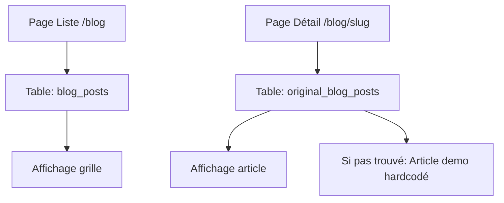

# AUDIT COMPLET DU SYSTÈME BLOG - Guide de Lyon
Date: 07/01/2025

## 📊 RÉSUMÉ EXÉCUTIF

### État actuel
- **Architecture**: Système blog fonctionnel avec pages Next.js client-side
- **Tables utilisées**: `blog_posts` et `original_blog_posts` dans Supabase
- **Problème principal**: La page détail affiche toujours le même contenu par défaut
- **Points forts**: Interface utilisateur moderne, système de catégories et tags

## 🏗️ PHASE 1: AUDIT DE L'ARCHITECTURE

### Structure des fichiers blog
```
app/
├── blog/
│   ├── page.tsx (Liste des articles - 392 lignes)
│   └── [slug]/
│       └── page.tsx (Détail article - 348 lignes)
```

### Analyse technique

#### `/app/blog/page.tsx`
- **Type**: Client Component (`'use client'`)
- **Fonctionnalités**:
  - Récupération des articles depuis `blog_posts`
  - Système de recherche et filtrage par catégorie
  - Affichage en grille avec article featured
  - Données de démonstration si Supabase non disponible
  - Newsletter CTA

#### `/app/blog/[slug]/page.tsx`
- **Type**: Client Component (`'use client'`)
- **Table source**: `original_blog_posts` (⚠️ Différente de la page liste!)
- **Problème identifié**: Article de démonstration hardcodé toujours affiché
- **Fonctionnalités**:
  - Récupération par slug
  - Articles similaires
  - Partage social
  - Tags cliquables

### 🔴 PROBLÈME CRITIQUE IDENTIFIÉ

**Les deux pages utilisent des tables différentes:**
- Page liste: `blog_posts`
- Page détail: `original_blog_posts`

Cela explique pourquoi le contenu ne correspond pas!

## 📊 DONNÉES SUPABASE

### Tables identifiées
1. **blog_posts** - Table principale (utilisée par la liste)
2. **original_blog_posts** - Table secondaire (utilisée par le détail)

### Structure des données (BlogPost interface)
```typescript
interface BlogPost {
  id: string
  slug: string
  title: string
  excerpt: string
  content: string
  image_url?: string | null
  image_alt?: string | null
  featured_image?: string | null
  category: string
  tags: string[] | null
  author_name?: string
  author?: {
    name: string
    avatar?: string
    bio?: string
  }
  created_at: string
  published_at?: string
  reading_time?: number
  status?: string
  meta_title?: string
  meta_description?: string
}
```

## 🔍 SEO & MÉTADONNÉES

### État actuel
- **Pas de generateMetadata** pour le SEO dynamique
- **Pas de sitemap** pour les articles blog
- **Pas de meta tags** Open Graph
- **URLs**: Structure simple `/blog/[slug]`

### Points d'amélioration SEO
1. Métadonnées dynamiques manquantes
2. Pas de schema.org
3. Pas de canonical URLs
4. Pas de robots.txt spécifique

## 🎯 DIAGNOSTIC DES PROBLÈMES

### Problème #1: Tables incohérentes
- **Gravité**: CRITIQUE
- **Impact**: Les articles affichés dans la liste ne correspondent pas au détail
- **Solution**: Unifier sur une seule table ou créer une vue

### Problème #2: Contenu de démonstration hardcodé
- **Gravité**: HAUTE
- **Impact**: Même contenu affiché pour tous les articles non trouvés
- **Solution**: Retourner 404 ou rediriger vers la liste

### Problème #3: Client-side rendering uniquement
- **Gravité**: MOYENNE
- **Impact**: Mauvais pour le SEO et les performances
- **Solution**: Migrer vers Server Components avec generateStaticParams

### Problème #4: Pas de gestion d'erreur appropriée
- **Gravité**: MOYENNE
- **Impact**: Expérience utilisateur dégradée
- **Solution**: Pages d'erreur personnalisées

## 📦 DÉPENDANCES

### Packages utilisés
- `@supabase/supabase-js` (via `/lib/supabase`)
- `lucide-react` pour les icônes
- Next.js App Router
- TypeScript

## 🔄 FLUX DE DONNÉES ACTUEL



## ✅ CE QUI FONCTIONNE BIEN

1. **Interface utilisateur** moderne et responsive
2. **Système de recherche** et filtrage
3. **Catégories et tags** bien structurés
4. **Design** cohérent avec le reste du site
5. **Fallback** avec données de démonstration

## ⚠️ CE QUI DOIT ÊTRE CORRIGÉ

### Priorité CRITIQUE
1. Unifier les tables sources (blog_posts vs original_blog_posts)
2. Supprimer le contenu hardcodé dans la page détail

### Priorité HAUTE
3. Implémenter le SSR/SSG pour le SEO
4. Ajouter les métadonnées dynamiques

### Priorité MOYENNE
5. Créer un sitemap pour les articles
6. Implémenter la pagination
7. Ajouter un système de cache

## 📋 PLAN D'ACTION RECOMMANDÉ

### Phase 1: Correction urgente (1-2 jours)
1. **Sauvegarder** tout le système actuel
2. **Identifier** la bonne table source
3. **Unifier** les requêtes sur une seule table
4. **Tester** la non-régression

### Phase 2: Amélioration progressive (3-5 jours)
5. Migrer vers Server Components
6. Ajouter generateMetadata
7. Implémenter generateStaticParams
8. Créer le sitemap dynamique

### Phase 3: Optimisation (Semaine 2)
9. Ajouter le cache ISR
10. Implémenter la pagination
11. Optimiser les images
12. Ajouter les analytics

## 🛡️ SAUVEGARDES NÉCESSAIRES

Avant toute modification:
1. Backup Git complet
2. Export des tables Supabase
3. Screenshots des pages actuelles
4. Documentation des URLs existantes

## 📈 MÉTRIQUES DE SUCCÈS

- [ ] Tous les articles affichent leur contenu correct
- [ ] Pas de régression sur les fonctionnalités existantes
- [ ] Amélioration du score Lighthouse SEO
- [ ] Temps de chargement < 2 secondes
- [ ] Zéro erreur 404 sur les articles existants

## 🚨 RISQUES IDENTIFIÉS

1. **Perte de données** si mauvaise table choisie
2. **Cassage des URLs** existantes (impact SEO)
3. **Régression** des fonctionnalités actuelles
4. **Incompatibilité** avec d'autres parties du site

## 💡 RECOMMANDATIONS FINALES

1. **NE PAS** supprimer de données sans backup
2. **TOUJOURS** tester en local avant production
3. **PRÉSERVER** les URLs existantes
4. **DOCUMENTER** chaque changement
5. **ROLLBACK** immédiat si problème

---

## ANNEXES

### Fichiers blog existants
- `/app/blog/page.tsx` - Page liste
- `/app/blog/[slug]/page.tsx` - Page détail
- `/lib/supabase.ts` - Client Supabase

### Tables Supabase
- `blog_posts` - Table principale
- `original_blog_posts` - Table secondaire

### URLs actuelles
- `/blog` - Liste des articles
- `/blog/[slug]` - Détail d'un article

---

Rapport généré automatiquement le 07/01/2025